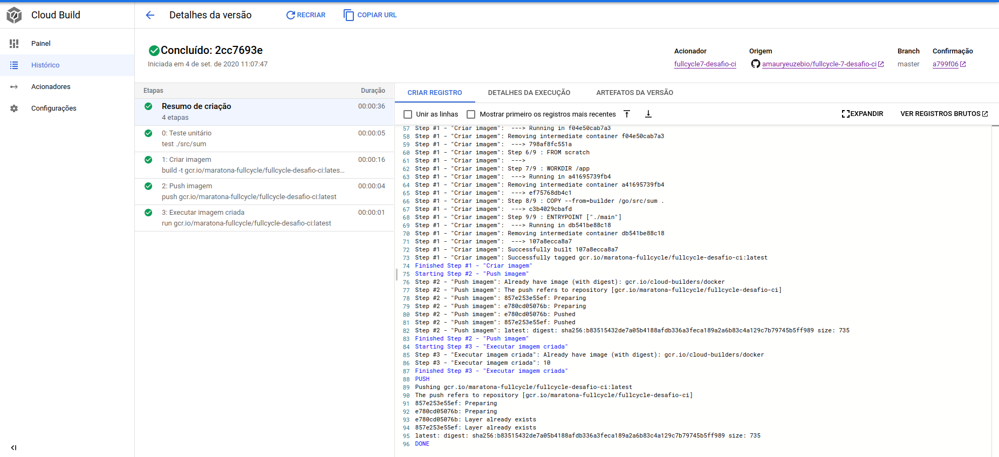

# Desafios FullCycle Turma 7
## Curso: Desenvolvimento de Aplicações Modernas e Escaláveis com Microsserviços

### Pré requisitos
- Instalação docker.

### Build da imagem
```docker
docker build . -t desafio-ci
```

### Executar a imagem
```docker
docker run --rm desafio-ci
```

### Resultado desafio de CI.


